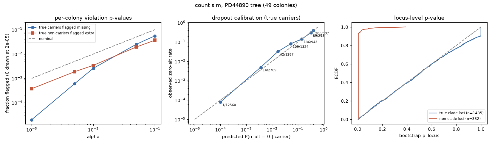
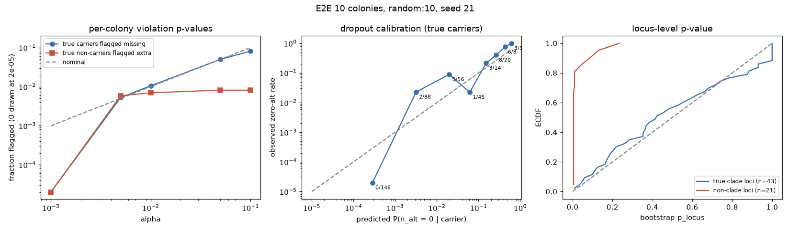

# Phylogeny as the truth proxy: measuring the caller's discriminatory power

Colon colonies (and crypts) carry many somatic L1 insertions. We run the TPRT pipeline on them
and use the colonies' SNV phylogeny to tell real insertions from false ones. A true somatic
insertion is inherited by exactly the colonies below one branch of the SNV tree (a clade).
Artefacts and false calls scatter over the tree. The method has to be probabilistic: a clade
member with no alt reads may be a chance dropout (low depth) or a real violation (high depth),
and an alt read outside the clade may be background noise or a real extra carrier.

Code: `tools/phylo/` (tree, genotype_likelihood, tree_fit, discrimination, calibration,
simulate_counts); simulator tree mode `test/simlib/phylo.py` + `build_donor.py --tree`;
E2E glue `test/e2e/run_phylo_e2e.sh`, `test/e2e/phylo_truth.py`; tests `test/test_phylo_model.py`.

## 1. Farm interface (fixed)

```bash
python tools/phylo/tree_fit.py --genotypes <patient>.genotypes.csv.gz --genotype-dir <run>/genotypes \
    --tree <patient>_snp_tree_with_branch_length.tree --annotation <patient>.annotated.tsv \
    --out <run>/phylo [--sex M|F|auto] [--samples colonies.tsv] [--min-depth N]
python tools/phylo/discrimination.py --fit <run>/phylo/phylo_fit.tsv --out <run>/phylo/discrimination
```

* `--genotype-dir` is required in practice. The per-colony files (`genotypes/<SAMPLE>.txt.gz`,
  Rust genotyper: `insertion genotype score_genotype score_alternative coverage n_alt n_ref n_art`)
  carry the read counts. `<patient>.genotypes.csv.gz` (combine_genotypes) has calls only and is
  used just to flag `passes_combine_genotypes`. All contract loci are fitted, not only those that
  pass combine_genotypes' gates, so the gates themselves can be evaluated.
* Colonies are the intersection of the genotype-file stems, the tree tips and (optionally)
  `colonies.tsv:sample`. The tree is pruned to them; unary nodes are collapsed and their lengths
  summed. The run log in `summary.md` lists the dropped colonies and tips.
* Per-colony vote counts only: the genotyper does not report per-junction counts (one vote per
  read, alt if any junction is alt), so the model is per locus × colony.
* Resources: 30,000 loci × 49 colonies took 150 s and 2.1 GB peak RSS (single core), including
  the bootstrap.
* The annotation table is read TAB- or comma-separated (sniffed from the header). annotate_v2
  writes TAB-separated text into `<P>.annotated.csv.gz`.
* `cluster/tprt/evaluate.sh` (farm kit) calls both CLIs per arm, then `compare_arms.py` reads
  `phylo_fit.tsv` columns `locus` and `phylo_label`. The chain is proven locally by
  `test/e2e/phylo_ab_local.sh`, which uses two E2E-derived stand-in arms (legacy vs .tprt
  genotyper on the same simulated patient) laid out as the kit's rundirs. It writes
  `ab_report.md` with the phylo labels of both arms.
* Needs `scipy` (added to requirements.txt). `matplotlib` is optional (PNGs are skipped without it).

## 2. Model

### 2.1 Read votes per colony

For locus i and colony c, the data are `a = n_alt` and `n = n_alt + n_ref`. One haplotype copy
yields a locus-kind-dependent number of votes: a TSD locus has two alt junctions per reference
span, and far pairs and one-sided loci are re-weighted by the genotyper. So we model the vote
odds per haplotype copy:

    K_ic = K_kind(i) · b_c          (alt votes per alt copy / ref votes per ref copy)

The expected alt-vote fraction, with purity p_c (the fraction of the colony's cells that descend
from its founder; the other cells carry none of its somatic variants):

| hypothesis | f |
|---|---|
| somatic clonal het, diploid | f1 = (p/2)K / ((p/2)K + 1 − p/2) |
| somatic, haploid (male X/Y) | f1 = pK / (pK + 1 − p) |
| germline het (all cells) | fg = K / (K + 1) |
| germline hom / hemizygous | one fraction shared by all colonies, ~ Beta(8, 1) (a hom locus reads 0.85-0.98: some reference-configuration reads survive) |
| absent | ε_c (background alt-vote rate: mapping, slippage) |

Counts follow a beta-binomial BB(a | n, f, ρ) with intra-class correlation ρ (ρ1 for present,
ρ0 for absent; ρ = 0 is the binomial). The present likelihood also has a small subclonal
component (weight λ, default 0.01) with the fraction uniform on (0, f1):

    P(a | n, present) = (1 − λ) BB(a | n, f1, ρ1) + λ · I_{f1}(a + 1, n − a + 1) / ((n + 1) f1)

The second term is the exact integral of Bin(a | n, u) over u ~ U(0, f1), where I is the
regularised incomplete beta. It stops one colony with a lower clonal fraction from vetoing a
clade outright, and it caps the per-colony violation evidence at about λ / ((n + 1) f1).

**Dropout probability** (reported as `p_dropout`): P(a = 0 | n, clonal carrier) = BB(0 | n, f1, ρ1).
For n = 2 at f1 ≈ 0.5 this is ≈ 0.25, which is chance. For n = 40 it is ≈ 1e-12, which is a
violation.

### 2.2 Parameter estimation (all from the patient's own data)

1. **Vote odds K_kind and allelic balance b_c**, from germline-het loci. Candidates are
   autosomal loci with a pooled alt fraction of 0.2-0.8, ≥ 10 reads, at least half of the colonies
   with ≥ 3 reads, and every such colony having ≥ 1 alt read. We use
   K_kind = (Σa + 0.5) / (Σr + 0.5) per kind (≥ 5 loci, else pooled), and
   b_c = (Σ_i a_ic + 5) / (Σ_i K_i r_ic + 5), where 5 pseudo-votes shrink sparse colonies to 1.
   From round 1 on, the candidates are the loci the fit itself classes as germline with a het
   root component.
2. **ρ1**: maximum likelihood on a grid over the germline-het cells.
3. **Purity p_c**: maximum likelihood on a grid (0.05-1.00) over the clade-member cells of
   confidently placed informative shared loci (best branch not the root, posterior ≥ 0.9,
   log10 BF ≥ 1). Private loci are excluded: they are selected for a confident carrier cell,
   which biases purity upwards, mostly in low-depth colonies. Colonies with < 3 cells get the
   median.
4. **ε_c**: pooled alt / informative over the out-of-clade cells of the same loci (private loci
   included), shrunk to the global rate with 1000 pseudo-reads. **ρ0**: maximum likelihood on those cells.
5. Three fit-and-update rounds. Germline-het loci do not inform purity, because germline alleles
   are also in the contaminating cells.

**Sex**: `--sex auto` looks at germline-like chrX loci. ≥ 2 het-like X loci means F. Otherwise
≥ 3 hom-like X loci, or a carried chrY locus, means M. If undecided, X is treated as diploid and
the run log says so. In males, chrX/chrY loci are haploid.

### 2.3 Hypotheses per locus

Cells with n = 0 (or n < `--min-depth`) are missing data and contribute 0 to every log-likelihood.

* **Branch b** (every non-root node: tips and internal nodes):
  log L_b = Σ_{c∈clade(b)} log P(d_c | present) + Σ_{c∉clade(b)} log P(d_c | absent).
  This is one matrix product, (ℓ1 − ℓ0) · M_b + Σ ℓ0.
* **Root** ("carried by all colonies"): a locus-level mixture of germline het (fixed fg),
  germline hom (shared fraction ~ Beta(8, 1), closed form) and somatic-in-all (f1 per colony),
  with weights 1/3 each (het excluded on haploid loci).
* **Prior over branches**: root 0.1. Other branches share 0.9 in proportion to their length
  (= mutation time, default; zero-length branches get a floor of 1 % of the mean length), or
  uniformly (`--branch-prior uniform`).
* **Non-tree alternatives**:
  * INDEP: each colony carries the insertion independently with probability π ~ U(0, 1). This is
    computed exactly: expand Π_c (π P1_c + (1 − π) P0_c) in the basis π^k (1 − π)^{C−k} by
    dynamic programming over colonies, then integrate each term to B(k + 1, C − k + 1).
  * NOISE: nobody carries it, and the locus has its own alt rate ε ~ Beta(0.5, 4) (mean 0.11)
    in every colony (closed form). A constant het or hom fraction is the root hypothesis
    instead, so the prior keeps NOISE at low fractions. This is the constant-allele-fraction artefact of
    `carrier-count-is-binomial-tail`.
* **Bayes factor**: log10 BF = log10 Σ_b prior_b L_b − log10 [(L_indep + L_noise) / 2].
* **Posterior over branches**, best branch (MAP), second branch.
* **Locus p-value** (`p_locus`), from a parametric bootstrap (B = 200) for informative shared and
  private loci. The statistic is G = Σ_c max_h log P(d_c | h) − max_b log L_b (saturated minus
  best branch). Data are simulated under the best branch with the fitted fractions and the
  observed depths, and p = (1 + #{G_sim ≥ G_obs}) / (1 + B).
* **Violations** under the best branch:
  * missing leaf: a clade member whose reads favour absence. It gets `p_chance` = P(A ≤ a | present).
  * extra carrier: an outside colony whose reads favour presence. It gets `p_chance` = P(A ≥ a | absent).
  * `flagged` = p_chance < α (0.01).

### 2.4 Classes and labels

A colony is a **confident carrier** if log10 P1/P0 ≥ 2, and a **confident wild-type** if
log10 P0/P1 ≥ 1 (this needs depth: 0 of 2 reads is not a confident wild-type).

| class | rule (first match) |
|---|---|
| `uninformative_depth` | no confident carrier |
| `noise` | NOISE beats every tree hypothesis by ≥ 1 log10 unit |
| `germline` | best = root and no confident wild-type |
| `informative_shared` | ≥ 2 confident carriers and ≥ 1 confident wild-type |
| `private` | exactly 1 confident carrier and the best branch is a tip |
| `uninformative_depth` | otherwise |

Label: `phylo_consistent` if log10 BF ≥ 1, `phylo_violating` if ≤ −1, `ambiguous` in between.
`phylo_label` is one verdict per locus for downstream tools (`cluster/tprt/compare_arms.py` picks
it by default): the label for `informative_shared`, `noise_violating` for `noise`, and the class
itself otherwise.
Labels are only meaningful for `informative_shared`. `private` loci, which are the bulk of somatic
L1 in colon, cannot be validated by a tree; `discrimination.py` reports their score distribution
next to the validated sets.

## 3. Outputs

| file | content |
|---|---|
| `phylo_fit.tsv` | one row per locus (`phylo_label` = the single verdict): `locus_kind`, `ploidy`, `total_alt/ref`, `n_carriers_observed`, `n_confident_wt`, `carriers`, `best_branch` (node id: tip name, `N<k>` preorder, `ROOT`), `best_clade`, `n_clade`, `branch_length`, `post_best_branch`, `second_branch`, `root_component`, log10 L of best / root / indep / noise, `log10_bf_tree`, `n_missing_leaves` / `n_extra_carriers` (flagged), `min_p_missing` / `min_p_extra`, `p_locus`, `class`, `label`, `passes_combine_genotypes`, then the annotate columns (a colliding name gets the prefix `ann_`, e.g. `ann_class`) |
| `violations.tsv` | per locus × colony candidate violation: kind, counts, expected fraction (f1 or ε), `p_dropout`, `p_chance`, log10 LR, `flagged` |
| `colony_params.tsv` | purity (+ cells used), allelic balance b_c, ε_c (+ cells), median / mean depth, f1 at a TSD locus, P(dropout) at the median depth, terminal branch length |
| `cells.tsv.gz` | every informative cell: counts, f1, ε, log10 LR, `p_dropout`, P(A ≤ a \| present), P(A ≥ a \| absent), in best clade |
| `summary.md` | run log, global parameters, class × label table, colony table, most violating loci |

`discrimination.py`: `report.md`, `features.tsv`, `roc_pr.png`, `score_by_class.png`. Among
informative shared loci, `phylo_consistent` is the TP proxy and `phylo_violating` the FP proxy;
`--include-noise` adds the `noise` class as FP. It gives AUC (Mann-Whitney) and average precision
with 1000-resample bootstrap CIs for:

* `tprt_score`, and `tprt_score_no_multicolony` (`multi_colony` is +1 on every shared locus, so it
  is circular);
* the `tprt_call` ordinal;
* every point feature parsed from `tprt_points`;
* numeric annotate columns.

It adds per-`element` / `structure` / `locus_kind` AUCs, legacy categorical precision
(`ann_class`, `conclusion`, `tprt_call`), the private / consistent / violating / germline / noise
counts per score band, and with `--truth` (simulation) the proxy-vs-truth agreement.

## 4. Validation on simulation

### 4.1 Count-level simulation (`tools/phylo/simulate_counts.py`)

The real PD44890 tree (49 colonies). Each colony gets a purity from U(0.7, 1), ε_c from
U(0.001, 0.006) and a depth of 15× (25 % of colonies at 0.15-0.4×, negative binomial). Loci:

* 3000 on branches (uniform), carried by exactly their clade;
* 600 germline (70 % het);
* 400 non-clade subsets;
* 300 locus-noise loci (constant 5-25 % alt everywhere);
* K = 2 (TSD-like), ρ = 0.01.



**(a) Calibration**

* Per-colony violation p-values are valid and conservative. Among 19,680 true-carrier cells, the
  fraction flagged as missing leaves is 0 / 0.0006 / 0.0026 / 0.025 / 0.056 at
  α = 0.001 / 0.005 / 0.01 / 0.05 / 0.1. Among 143,700 true non-carrier cells, the fraction flagged
  as extra carriers is 0.0004 / 0.0019 / 0.0034 / 0.019 / 0.037.
* Dropout probabilities are calibrated over four orders of magnitude (predicted vs observed
  zero-alt rate per bin): 1e-4 vs 0.8e-4, 0.0037 vs 0.0051, 0.017 vs 0.033, 0.054 vs 0.082,
  0.14 vs 0.14, 0.32 vs 0.30, 0.40 vs 0.41.
  * The two bins at 0.01-0.1 run high in this seed (42 vs 22 and 109 vs 71). With the TRUE
    parameters the same cells show the same excess.
  * A second seed simulated with ρ = 0 matches: observed by depth n = 3 / 4 / 5 is
    0.064 / 0.031 / 0.011 against 0.077 / 0.033 / 0.015 predicted. So the excess in this seed is
    binning plus sampling noise, not model bias.
  * The beta-binomial pmf was checked against 400k direct draws.
* The locus-level bootstrap p-value of true clade loci is uniform. Its ECDF follows the diagonal
  with a point mass at 1, so it is slightly conservative: p < 0.01 for 14 of 1357 and p < 0.05 for
  67 of 1357.
* Purity is recovered to ±0.05 for most colonies, and worst for low-depth colonies with few
  informative cells. ε is recovered to within ~30 %.

**(b) Consistent vs violating**

| truth | classed informative_shared | consistent | ambiguous | violating |
|---|---|---|---|---|
| clade (≥ 2 carriers) | 1357 / 1484 | 1241 (91 %) | 116 | **0** |
| non-clade subset | 328 / 400 | 0 | 8 | **320 (97.6 %)** |

* Best clade = true clade for 97.3 % of the informative true clade loci.
* All 300 noise loci are classed noise or uninformative (none are informative_shared or germline).
* 1268 of 1516 private loci are classed private (most of the rest have too little depth).
* 564 of 620 germline loci are classed germline; 56 are informative_shared, because a
  low-purity-looking colony gets a confident wild-type call.

**(c) Discrimination end to end.** The synthetic annotation scores real insertions higher by
design. tprt_score AUC is 0.894 [0.874-0.914] against the phylo proxy and 0.895 against truth on
the same loci, so the proxy does not distort the AUC. Private loci score lower than
phylo-consistent shared loci partly because they lack `multi_colony`; the report shows this
directly.

### 4.2 Full-stack E2E (`test/e2e/run_phylo_e2e.sh`)

The run simulates 10 colonies on a random coalescent tree (seed 21) through the full pipeline:
fullstack simulator → bwa → Rust discovery → combine → annotate_v2 → Rust genotyper (.tprt
contract) → tree_fit. Each colony gets a purity from U(0.7, 1) and a depth of 15× (low-depth
colonies 0.25-0.5×, here S2, S3, S7, S10). Events: 220 TP on branches (uniform), 15 % non-clade
decoys, 25 % at the root (60 % of those germline het, the rest somatic before the MRCA), and 60
artefacts (slippage artefacts on non-clade subsets).

```bash
cd /Users/jeremy/Documents/PEAR_TREE/.claude/worktrees/agent-af1cff52023dab033
OUT=/private/tmp/claude-501/-Users-jeremy-Documents-PEAR-TREE/fde0700f-e325-4651-8daf-0cdd52bd072b/scratchpad/work/e2e_phylo2 bash test/e2e/run_phylo_e2e.sh
```

283 genotyped loci: 46 clade, 49 private, 35 germline/root, 29 non-clade, and 134 `none` (hs1 vs
GRCh38 germline differences, mostly hom, plus STR length differences).



* **(a) Per-colony flags are calibrated.**
  * 380 true-carrier cells flagged as missing leaves: 0 / 0.5 % / 1.05 % / 5.0 % / 8.2 % at
    α = 0.001 / 0.005 / 0.01 / 0.05 / 0.1.
  * 858 true non-carrier cells flagged as extra carriers: ≤ 0.8 % at every α.
* **Dropouts run about 2× above prediction in the full pipeline** (bins 0.01-0.03: 5 observed
  vs 1.1 expected; 0.2-0.5: 14 vs 8.7). This is not binomial sampling. In the first run the
  zero-alt carriers concentrate on a few loci where the genotyper misses the alt reads in several
  carriers at full depth (e.g. an SVA_F clade with 0/12, 0/12 and 0/10 next to 5/16), so the alt
  yield varies per locus.
  * The model has no locus-level yield term. Such loci become `phylo_violating` or `ambiguous`
    (1 of 41 informative true clades is violating).
  * The violation p-values stay calibrated because the subclonal component floors them.
* **Purity is an effective parameter.** Estimated purity runs ~0.15 below the truth here because
  K (from 22 germline-het loci, K_TSD = 1.14) is pulled up by partial-fraction germline STR
  differences that pass as hets. Purity is then fitted to the somatic clade cells given K, so the
  expected fraction f1 still matches the observed somatic fractions, and the flags above are
  calibrated.
* **(b) Labels**:

| truth | informative_shared | consistent | ambiguous | violating |
|---|---|---|---|---|
| clade (≥ 2 carriers) | 41 / 46 | 27 | 13 | 1 |
| non-clade subset | 21 / 29 (8 more = `noise`) | 0 | 2 | **19** |

  * Best clade = true clade for 40 of 41.
  * 33 of 35 root events are `germline` (2 are `noise`: low-yield one-sided loci).
  * The `none` loci are 103 germline, 21 noise and 2 informative_shared (1 violating, 1 ambiguous).
  * 44 of 49 private events are `private`, and none are violating.
  * With 10 colonies the BF of a correct clade is modest, so a third of the true clades are
    `ambiguous`.
* **The bootstrap `p_locus`** of true clade loci is < 0.01 for 1 of 41 and < 0.05 for 3 of 41.
* **(c) `discrimination.py` runs end to end.** tprt_score AUC is 0.63 [0.47-0.77] here. That is
  expected and not a statement about the caller: the simulator's non-clade decoys are REAL
  insertion sequences placed on non-clade subsets, so the hallmark score should not separate
  them. In this simulation the phylo labels test the phylogenetic method; on colon data, where
  violating loci are real artefacts, the same report measures the caller.

**Farm chain.** `test/e2e/phylo_ab_local.sh` runs `cluster/tprt/evaluate.sh` (tree_fit +
discrimination per arm, then `compare_arms.py`) on the first E2E run. Arm A is the legacy
genotyper and contract, arm B the .tprt genotyper and extended contract. `ab_report.md` lists the
phylo labels of both arms: A has 245 loci (36 consistent, 14 violating, 23 noise_violating), B has
283 (39 consistent, 21 violating, 29 noise_violating).

## 5. How to read the outputs on a real patient

1. `summary.md`: check the parameters first.
   * Purity should be roughly 0.5-1.
   * ε should be ~1e-3 (higher means mapping or slippage noise).
   * K_TSD ≈ 1.5-2.5 (two alt junctions per reference span).
   * The number of germline-het loci should be ≥ 50, otherwise K falls back to the pooled or default value.
   * The sex call.
2. Class table: expect many `private` and `germline` loci, a smaller `informative_shared` set,
   and `noise` for slippage loci.
3. Within `informative_shared`, the violating fraction is the false-call rate of shared calls.
   `violations.tsv` explains each one: a deep missing leaf (`p_chance` ≪ 0.01 with
   `p_dropout` ≪ 0.01) or a strong extra carrier.
   * A recurrent extra-carrier colony across many loci points to contamination or index hopping.
   * A recurrent missing-leaf colony points to low purity or a wrong tip label.
4. `discrimination/report.md`: the AUC per feature is the discriminatory power of each hallmark.
   Compare the private set's score-band mix to consistent vs violating. If private loci look like
   the violating set, the single-colony calls are mostly artefacts.

## 6. Caveats

* **Purity vs K**: purity is identified only through K estimated on germline hets. If the
  germline-het set is contaminated (somatic near-root loci absent from one low-depth colony),
  K drops and purity rises. The strict "every covered colony has alt" rule and the round-1
  refinement address this.
* **Germline vs somatic before the MRCA**: these cannot be distinguished. Both are `germline`.
* **Small trees** (≤ 5 colonies): the BF cannot exceed ~10, so many true clades are `ambiguous`,
  not consistent.
* **The non-tree alternative** averages INDEP and NOISE equally. A violating locus is one that
  these explain better than any branch with chance dropouts and extra carriers. Biology that
  breaks the tree (LOH or a deletion removing the insertion in one colony, convergent insertion
  at the same site, mis-labelled colonies) is reported as violation and is visible in
  `violations.tsv`.
* **The genotyper's adjustments to n_ref** (`halve_single_junction_ref`, `dup_ref_discount`)
  make n a pseudo-count for one-sided and far-pair loci. K_kind absorbs the mean effect, but the
  beta-binomial then sees fewer effective trials, which is conservative.
* **Locus-level allele yield**: the genotyper sometimes misses a locus's alt reads in several
  carriers (E2E: an SVA_F clade with 0/12 in three deep carriers). The model has one vote-odds K
  per locus kind, so such loci read as missing leaves. In the full pipeline dropouts are about
  2× the binomial prediction. A per-locus yield multiplier integrated over a grid is the natural
  next step; it would cost about 7× runtime.
* **Purity is effective**, not physical, when K is contaminated (see 4.2). It is the parameter
  that makes f1 match the somatic fractions.
* **Bootstrap p-values** use plug-in parameters (no parameter uncertainty) and B = 200, so the
  floor is 0.005.
* **`multi_colony`** in `tprt_points` is circular for shared loci. `tprt_score_no_multicolony`
  is reported for that reason.
